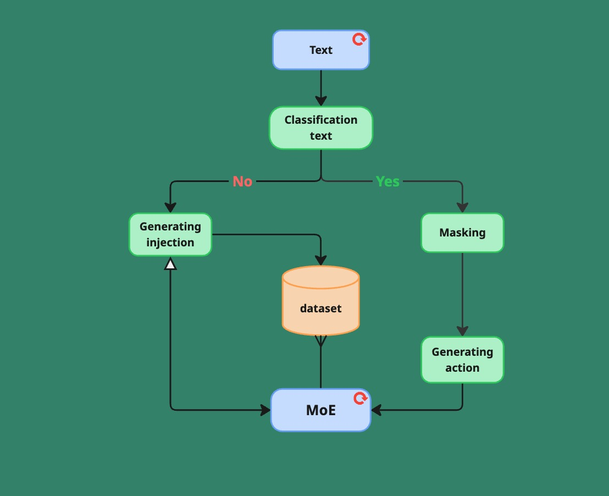
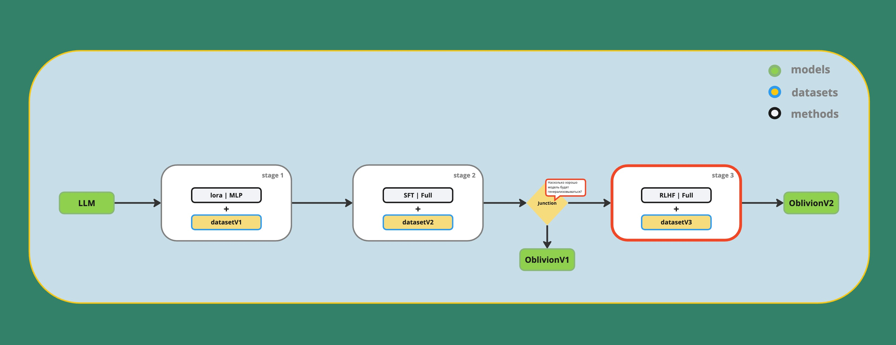

# Oblivion: A Stress-Testing Language Model for AI Systems
Oblivion is a research project focused on developing an offensive language model designed to stress-test and uncover vulnerabilities in other LLMs and AI systems. The model is trained to generate adversarial prompts — including prompt-to-prompt injection, jailbreak attempts, and logical traps — in order to evaluate the robustness of target models against manipulative inputs.

### Key features:

---
* **Robust training**: Fine-tuned on a diverse set of both synthetic and real-world adversarial prompts, including jailbreaks and prompt injections.
* **Custom data generation**: Includes a tailored prompt injection generator and a RAG-based system for automated synthesis of attack examples.
* **Evaluation metrics**: success rate ([LLAMATOR](https://github.com/LLAMATOR-Core/llamator)).
---

## Pipeline for data synthesis

* **Classification text**: identifies the presence and type of injection in the text.
* **Generating injection**: generates adversarial (injection) prompts.
* **Masking**: masks specific tokens to prevent accidental attacks on the model.
* **Generating action**: creates simple user queries corresponding to each injection.
* **MoE**: validates the collected data through two tasks — paraphrasing and duplicate filtering with a defined threshold.
---

## Alignment fine-tuning

1. **Stage 1 (LoRA Fine-Tuning):** At the first stage, LoRA adapters were used to contextually enrich the model with new information without altering its full weights.
2. **Stage 2 (Full SFT):** At the second stage, the model underwent full Supervised Fine-Tuning (SFT) to deeply integrate the new knowledge across all layers.
3. **Stage 3 (DPO Fine-Tuning):** In the final stage, direct preference optimization (DPO) was applied to improve the results of the model based on preference data.

## Result
Datsets: [dataset1](https://huggingface.co/datasets/r1char9/prompt-2-prompt-injection-v1-dataset) | [dataset2](r1char9/prompt-2-prompt-injection-v2-dataset) | [dataset3](#) | dataset4  
Models: [Oblivion-stage1](https://huggingface.co/r1char9/Oblivion2.5-1.5B-v1) | [Oblivion-stage2](#) | [Oblivion-stage3](#)  